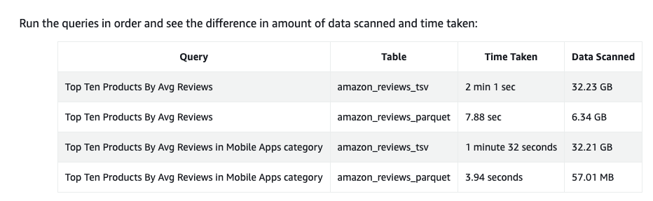
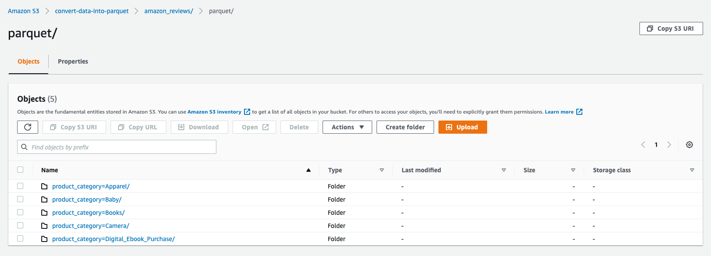
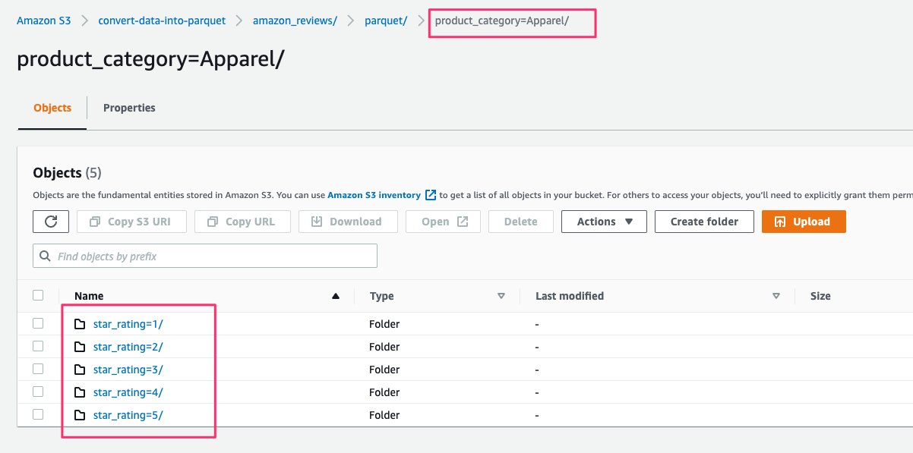
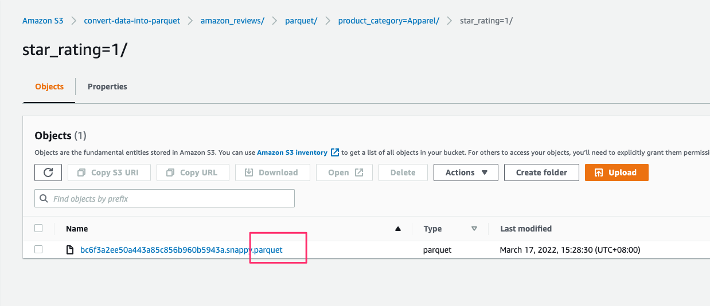
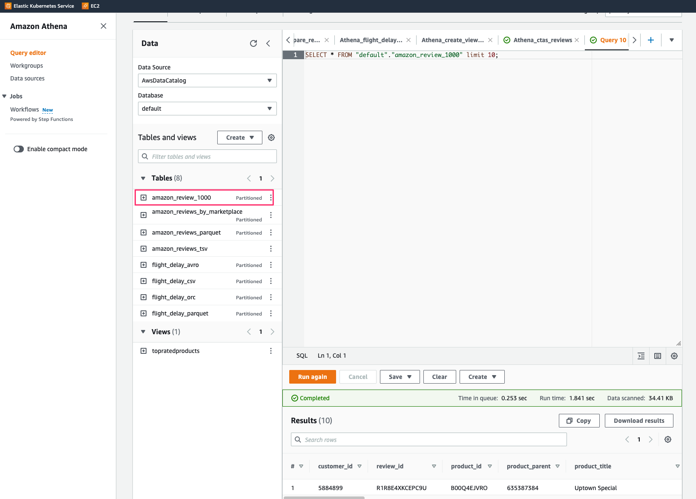
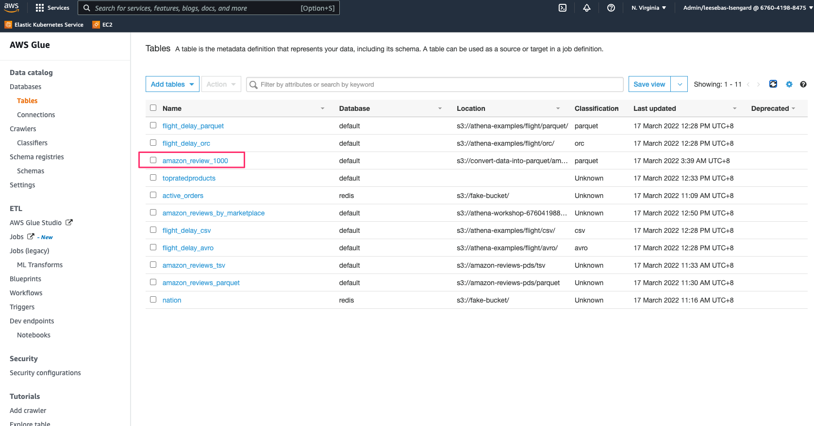

# Introduction

Apache Parquet is a columnar file format that provides optimizations to speed up queries and is a far more efficient file
format than CSV or JSON, supported by many data processing systems.

It provides efficient data compression and encoding schemes with enhanced performance to handle complex data in bulk. It also reduces data storage by 75% on average.

# Objective

Show a sample code on how to convert CSV to parquet format with partitioning (Hive style format) 

# Performance

Data set: https://us-east-1.console.aws.amazon.com/s3/buckets/amazon-reviews-pds?region=us-east-1&tab=objects



# How to run

```shell
# rename env.sh.sample to env.sh and update with required credentials
> mv env.sh.sample env.sh

# run application
> . ./start.sh

     customer_id       review_id  product_id  ...  review_date marketplace  year
0       13069613   RWB85TRJPI5Z1  B0041LG08U  ...   2015-08-31          US  2015
1       33923529  R102628UTIS8PD  B004PKTU5M  ...   2015-08-31          US  2015
2       34831859  R183D7E2WM33XE  B009KWU6Q2  ...   2015-08-31          US  2015
3       23583629   R9LOP49WTNCC9  B00004RJ71  ...   2015-08-31          US  2015
4       26211978  R1YYD5SR2E7IJ9  B00LD1OHE0  ...   2015-08-31          US  2015
..           ...             ...         ...  ...          ...         ...   ...
995     25954907  R17G7565ZC2B3U  B009NH6JRE  ...   2015-08-31          US  2015
996     40862185   RA590EEQYHDRT  B0088RQ4X4  ...   2015-08-31          US  2015
997     25302320   RPJ5D4KMWDP8V  B00APJLFEG  ...   2015-08-31          US  2015
998     31829040  R1NFETG1N2L1WS  B009OYSFDM  ...   2015-08-31          US  2015
999     20180780  R2HX79YR8P8OWK  B00P42WROG  ...   2015-08-31          US  2015

[1000 rows x 15 columns]

```


# Screenshots

## Partition




## Athena


## Glue data catalog



# References

1. https://catalog.us-east-1.prod.workshops.aws/workshops/9981f1a1-abdc-49b5-8387-cb01d238bb78/en-US/
2. https://docs.aws.amazon.com/athena/latest/ug/partitions.html
3. https://docs.aws.amazon.com/AmazonS3/latest/userguide/optimizing-performance.html
4. https://aws.amazon.com/premiumsupport/knowledge-center/athena-create-use-partitioned-tables/

# FAQ

## How to convert deserialize Dynamodb object to JSON?

https://github.com/sebastianlzy/convert-data-into-parquet/blob/master/app/load_to_dynamoDB.py

<details>
<summary>DynamoDB object</summary>
```json
{
    "total_votes": {
        "N": "0"
    },
    "product_title": {
        "S": "Sony TDG-500P Passive 3D Glasses"
    },
    "star_rating": {
        "N": "1"
    },
    "customer_id": {
        "N": "27627839"
    },
    "marketplace": {
        "S": "US"
    },
    "helpful_votes": {
        "N": "0"
    },
    "review_headline": {
        "S": "One Star"
    },
    "review_id": {
        "S": "RS7RLMV1GPEHA"
    },
    "review_date": {
        "S": "2015-08-31"
    },
    "product_id": {
        "S": "B00C7O0YEY"
    },
    "review_body": {
        "S": "They did not work with my Sony TV"
    },
    "product_category": {
        "S": "Electronics"
    },
    "year": {
        "N": "2015"
    },
    "verfied_purchase": {
        "S": "Y"
    },
    "product_parent": {
        "N": "169087862"
    }
}
```
</details>

Code
```python
def lambda_handler(event, context):
    records = read_from_dynamodb()
    print(json.dumps(records["Item"], indent=4))

    amazon_review = ddb_deserialize(records["Item"])
    print(json.dumps(amazon_review, cls=DecimalEncoder, indent=4))
    return {'statusCode': 200}
```

<details>
<summary>JSON</summary>
```json
{
    "total_votes": "0",
    "product_title": "Sony TDG-500P Passive 3D Glasses",
    "star_rating": "1",
    "customer_id": "27627839",
    "marketplace": "US",
    "helpful_votes": "0",
    "review_headline": "One Star",
    "review_id": "RS7RLMV1GPEHA",
    "review_date": "2015-08-31",
    "product_id": "B00C7O0YEY",
    "review_body": "They did not work with my Sony TV",
    "product_category": "Electronics",
    "year": "2015",
    "verfied_purchase": "Y",
    "product_parent": "169087862"
}
```
</details>

## How to load data to Kinesis firehose?

https://github.com/sebastianlzy/convert-data-into-parquet/blob/master/app/put_record_into_firehose.py

```shell
 response = client.put_record(
        DeliveryStreamName=DELIVERY_STREAM_NAME,
        Record={
            'Data': convert_to_byte(str(get_data()))
        }
    )
    print(response)

```